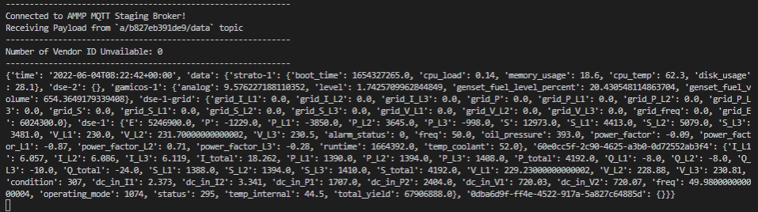

# Data Acquisition From MQTT Broker

## Objective

This project entails connecting to remote IoT devices of oil and gas vessels owned by customers of a Netherland based company. 
We connect to the company's staging server and extract information about the vessels including process variables. Data transformation is also carried out for easier understanding and interpretation. The final output is dumped in JSON format for subsequent analysis.

### Conceptual Part

#### What pros and cons do you see with respect to obtaining readings from an MQTT broker, vs getting them via a REST API?

MQTT is a lightweight publish/subscribe architecture that is designed for resource-constrained devices and low-bandwidth setups. 
It is used a lot for Internet of Things devices, or other machine-to-machine communication.

Pros:
* Designed for resource-constrained devices with small code footprint.
* Best for setups with varying level of latency - maximizes available bandwidth.
* Fast and efficient message delivery system.
* Quick to implement.
* Works well for one-to-many simulateneous communcation between devices.
* Major cloud service providers support MQTT.

Cons:
* Useful for sending only small portions of data to servers.
* Authentication is not encrypted by default. Unfortunately, SSL/TLS which isn't lightweight must be employed for security.
* It is often difficult to create a globally scalable MQTT network due to its topic structure. As topic tree grows, complexity increases.
* MQTT may suffer from high latency projects.
* REST APIs can work with files, objects, and media with actions such as POST, GET, PUT, UPDATE, and DELETE; however, MQTT allows for only publishing and subscribing via a broker with smaller data.

#### How would you run an acquisition function that subscribes to an MQTT broker? For example would you trigger it periodically via a scheduler, or would you have it running as some sort of continuous "listener" function?

The acquisition function in this case is subjective to the existing system. If there are certain periods of the day that an MQTT broker is expected to provide feedback, then, a scheduler is preferred. This solution helps to reduce operational costs by stopping resources that are not in use and starting resources when needed. 
However, if the MQTT broker is expected to provide feedback at any instance - not a defined period in a day - then a continuous listener function would be preferred. 

#### What underlying AWS service would you run it on? E.g. EC2 vs ECS vs Lambda, etc.

Lambda. 

### Practical

#### Write a script in Python 3, to carry out data acquisition from the MQTT broker, and output the acquired raw data to screen.

| Details            |              |
|-----------------------|---------------|
| Programming Language: |  Python 3  |

#### What it Does

The `app.py` application aims to connect to the MQTT staging server, subscribes to a topic, receives a message dumped to JSON and eventually outputs the necessary information from some remote IoT device about an oil and gas vessel.

#### Setup

* Clone this repository
* In your terminal, navigate to the repository path
* Install the necessary dependencies:

```
pip3 install -r requirements.txt
```

* Run app with the following command-line argument:

```
app.py -n <hostname> -p <port> -t <topic> -u <username> -P <password> -caf <certification_file>
```
#### Documentation

```
usage: app.py [-h] [-n HOSTNAME] [-p PORT] [-t TOPIC] -u USERNAME -P PASSWORD [-caf CERTIFICATION_FILE]

optional arguments:
  -h, --help            show this help message and exit
  -n HOSTNAME, --hostname HOSTNAME
                        AMMP's MQTT Broker server hostname (default = "mqtt.stage.ammp.io").
  -p PORT, --port PORT
                        AMMP's MQTT Broker server port (default = 8883).
  -t TOPIC, --topic TOPIC
                        Topic to subscribe and listen on (default = "a/b827eb391de9/data").
  -u USERNAME, --username USERNAME
                        Username for authentication.
  -P PASSWORD, --password PASSWORD
                        Password for authentication.
  -caf CERTIFICATION_FILE, --caf_file CERTIFICATION_FILE
                        Path to CA certification file (default = "ca-stage.crt") .
```

With the right credentials, you should have an output similar to this below:



### Reference

- [MQTT Official Site](https://mqtt.org)
- [Basics of MQTT](https://www.techtarget.com/iotagenda/definition/MQTT-MQ-Telemetry-Transport)
- [AWS Elastic Load Balancing](https://docs.aws.amazon.com/elasticloadbalancing/latest/application/introduction.html)
